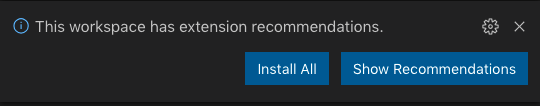
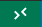
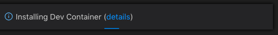
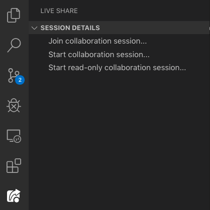
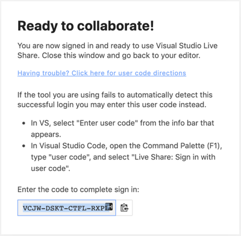
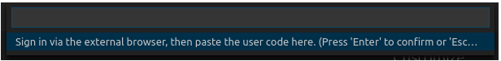

# Node.js + TypeScript development container

A VS Code Dev Container environment for Node.js + Typescript

This project provides a basis for collaborative development of Node.js projects, using Typescript, within a development container. It takes advantage of VS Code integration with the [Remote - Containers extension](https://code.visualstudio.com/docs/remote/containers).

The idea of development containers is to require as little dependency installation as as possible on one's local system, and also to make the development environment consistent and predictable across a team running different operating systems.

This implementation automates and standardises the installation of:

- Node.js
- npm
- Typescript

...on the dev container when its image is built (via `.devcontainer/Dockerfile`).

The config information in `.devcontainer/devcontainer.json` then standardises the VS code experience when running the development container with:

- ESlint extension
- The VS Code live share extension
- A VS Code markdown linter

Pinning these to the dev container prevents one's local VS Code configuration being affected by the required functional extensions for a particular project. Your personal visual/aesthetic configuration will persist across local and dev container VS Code sessions.

## Prerequisites

- [VS Code](https://code.visualstudio.com/) with "[Remote - Containers](https://marketplace.visualstudio.com/items?itemName=ms-vscode-remote.remote-containers)" extension (recommended)
- [Docker](https://docs.docker.com/install/)

### Setup

After cloning the project, open it in VS Code:

`cd ./nodejs-typescript-dev-container && code .`

VS Code will then suggest you install the 'extension recommendations'.

Currently this is only the [Remote - Containers extension](https://code.visualstudio.com/docs/remote/containers), which allows you to remote into the dev container similar to the experience of editing code in a remote VM.

Click "Install All".

If you would like to review these recommendations before installing, they are in `.vscode/extensions.json`.

You can also install this extension manually by finding it in the VS Code marketplace under `ms-vscode-remote.remote-containers`.

### Launching the development container

Click the "open a remote window" button in the bottom left of your VS Code window. It looks like:

The command pallete will suggest relevant commands.

Select 'open folder in container'.

This will open a window showing your local file system (In Finder on Mac, File Explorer on Windows). When in the root of the repo in this view, click "open".

This will launch you into the dev container. Take a moment to ensure all expected extensions are installed, and you have access to an integrated terminal.

You can click 'show details' as the container boots up to look out for and debug any potential problems with the build process, described in `.devcontainer/Dockerfile`.

### Using VS Code live share within the Dev Container

This requires an extra step to the usual process.

Click the Live Share button in the left sidebar of VS Code and start a collaboration session.

If it's the first time you've used Live Share in a while, VS Code will often launch a browser window, requesting that you sign into a Microsoft account, after which it'll typically say "Ready to Collaborate!" and start a collaboration session in your VS Code window.

When running in a container, however, you'll need to click "Having trouble? Click here for user code directions":

Copy the code under "Enter the code to complete sign-in:" to your clipboard (as above), and paste it into the prompt that opens in VSCode:

This should start your collaboration session and allow you to paste a link for team members to join you in the dev container.

### Known issue - Refreshing dependencies

Should you want to update any dependencies installed on the dev container Ubuntu image, it's important to note that VS Code may (apparently, as observed) cache your container images itself - outside of Docker, which can lead to some inconsistency.

This can result in a situation in which launching into a dev container through the 'open folder in container' command does not update - for example - your installation of Node with the version described in `.devcontainer/Dockerfile`.

In this case, you might need to again click the "Open a remote window" button in the bottom left of the VS Code session, and then click "Rebuild container". This will force VS Code to build the container from scratch using the current Dockerfile, and not from its own cache, ensuring all requested packages are installed as expected.
